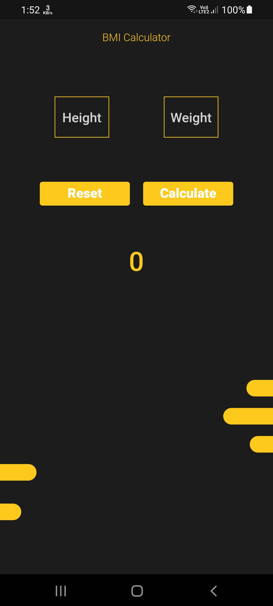
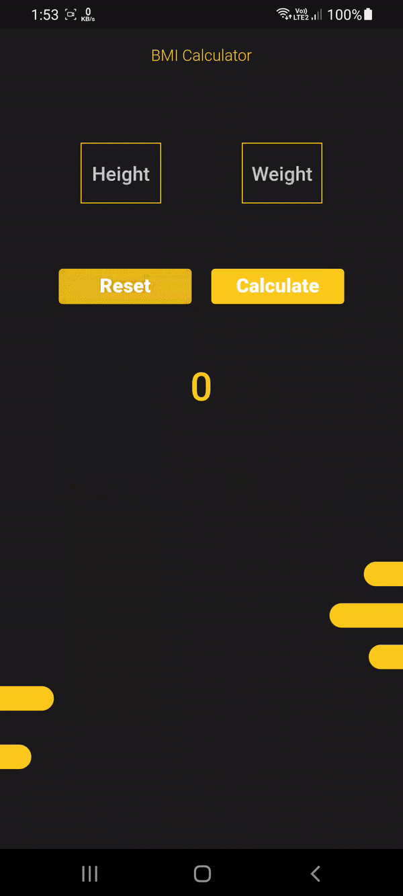

# bmi 🧮

Simple BMI app with a nice UI and easy use.

 

## 📱 Screen Shots
 

## 🎥 Promo Video
 

 

## 🔑 License
- This project is licensed under the MIT License - see the [LICENSE](LICENSE.md) file for details

## 🧑 Author

#### Ahmad Alzoabi

You can also follow my GitHub Profile to stay updated about my latest projects:

If you liked the repo then kindly support it by giving it a star ⭐!

Copyright (c) 2023 Ahmad Alzoabi

## Visitors Count

